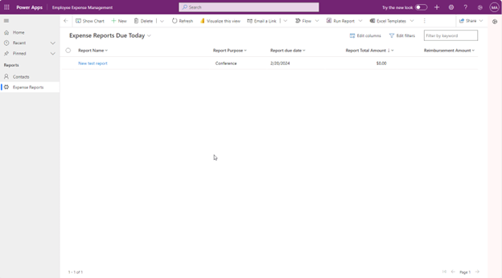

---
lab:
  title: 实验室 4.4：生成模型驱动应用
---

# 实验室 4.4：生成模型驱动应用

## 场景
Bellows College 是一所教育机构，拥有多个校园并开设有多门课程。

许多 Bellows College 的讲师和管理员都需要参加活动，并购买项目。 从以往看来，跟踪这些费用并非易事。
校园管理层希望通过向员工提供一种报告费用的数字方式，以实现费用报告系统的现代化。

在整个课程中，你将构建应用程序并执行自动化，使 Bellows College 员工能够管理费用。

## 概要实验室步骤
作为创建模型驱动应用的一部分，你将完成以下操作：
- 配置名为“员工支出管理”的新模型驱动应用

我们将使用以下组件：
- 视图：视图允许用户显示表单表中的现有数据。
- 窗体：用户在此处创建/更新表中的新记录。
两者都将集成到模型驱动应用中，以提供更好的用户体验。

## 先决条件
- 完成“模块 1 实验室 0 - 验证实验室环境”

## 练习 1：创建模型驱动应用
**目标：** 在本练习中，将使用在实验室 4.3 中配置的模型驱动应用。 然后，将自定义站点地图并测试应用。
为简单起见和节约时间，我们不会讨论此实验室中的全部“报表支出”列。

## 任务 1：配置站点地图
1. 如果尚未登录，请登录到 `https://make.powerapps.com`
2. 请在右上角选择将支出报表解决方案导入的环境（如果尚未选择）。
3. 使用左侧导航栏，选择“**解决方案**”。
4. 打开支出报表解决方案。
5. 查找上一个练习中创建的 *`Employee Expense Management`* 应用程序。
6. 选择“**编辑**”以打开现代应用设计器。
7. 在命令栏上，选择“**+ 添加页面**”。
8. “**添加页面**”屏幕将打开。
9. 选择 **Dataverse 表。**
10. 选择下表：
    - 支出报表
    - 支出行
11. 请务必选择“在导航中显示”。
12. 选择两个表后，选择“**添加**”。
13. 在“导航”下，选择“**支出报表**”窗体。
14. 转到屏幕右侧的“在此应用”部分。
15. 选择“**显示更多**”。
16. 选择信息快速视图窗体旁边的**省略号**。
17. 从显示的菜单中，选择“**移除**”。
18. 选择信息卡窗体旁边的**省略号**。
19. 从显示的菜单中，选择“**移除**”。
20. 在“导航”下，选择“**支出行**”窗体。
21. 转到屏幕右侧的“在此应用”部分。
22. 选择“**显示更多**”。
23. 选择信息快速视图窗体旁边的**省略号**。
24. 从显示的菜单中，选择“**移除**”。
25. 选择信息卡窗体旁边的**省略号**。
26. 从显示的菜单中，选择“**移除**”。
27. 选择“保存”，然后等待更改保存完毕。
28. “保存”完成后，选择“**发布**”按钮发布所做的更改。 等待发布完成。

### 任务 #2：测试应用
**启动应用程序**
1. 选择“播放”按钮，模型驱动应用将在新选项卡中加载。

**创建新的支出报表**
1. 从左侧导航（也称为站点地图）中，选择“**支出报表**”。
2. 选择“+ 新建”  。
3. 按照如下所示输入字段信息：
    - 报表名称：**`New Test Report`**
    - 报表用途：选择 **`Conference`**
    - 报表截止日期：选择 **`Today's date`**
4. 选择**保存并关闭**。 此操作将会创建新的测试报表，你应该能够在“活动支出报表”视图中看到它。
5. 使用“活动支出报表”旁边的下拉列表，将视图更改为“**今天到期的支出报表**”。
6. 可以添加更多测试记录。

正在运行的模型驱动应用看上去大致如下图所示：

祝贺你！ 你已创建并配置了第一个模型驱动的应用。
